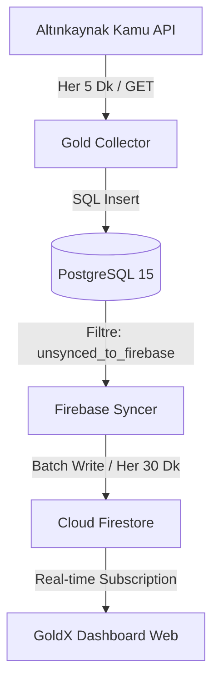
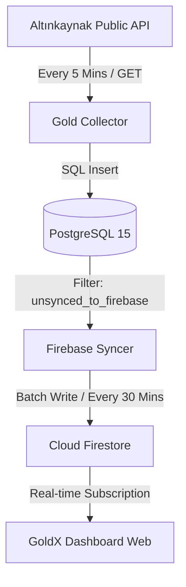

# [TR] Gold Tracker System (GoldX Suite) 🪙📈

Bu depo, canlı altın fiyatlarını otomatik olarak toplayan, ilişkisel bir veritabanında arşivleyen ve Firestore / Firebase Hosting kullanarak gerçek zamanlı (real-time) görselleştiren uçtan uca modern bir tam yığın (full-stack) sistemdir.

---

## 🏛️ Genel Mimari ve Veri Akışı

Sistem, veri kotalarını aşmamak ve gereksiz maliyetleri önlemek amacıyla optimize edilmiş bir asenkron mimariye sahiptir:



1. **Toplama Aşaması:** `project gold/collector` servisi 5 dakikada bir çalışarak API'den verileri çeker ve yerel **PostgreSQL 15** veritabanına kaydeder.
2. **Kademeli Senkronizasyon:** `project gold/syncer` servisi her 30 dakikada bir tetiklenerek Postgres'te henüz Firestore'a gitmemiş verileri toplu (batch) olarak **Cloud Firestore**'a aktarır ve Postgres'teki satırları günceller.
3. **Canlı İzleme:** **Firebase Hosting** üzerinde çalışan `firebase_gold` arayüzü, Firestore'u soket tabanlı dinler. Veri yazıldığı anda sayfa yenilenmeden grafikler ve fiyatlar parıldayarak güncellenir.

---

## 📁 Depo Dosya Ağacı (Monorepo)

```text
.
├── firebase_gold/ (Sadece Canlı Arayüz)
│   ├── .firebase/            # Firebase yerel cache dosyaları
│   ├── .firebaserc           # Firebase hedef proje belirteci
│   ├── .gitignore            # Frontend Git engelleme kuralları
│   ├── firebase.json         # Firebase Hosting kuralları
│   ├── README.md             # Frontend kullanım kılavuzu
│   └── public/
│       ├── app.js            # Firestore dinleyici ve Chart.js lojiği
│       └── index.html        # Glassmorphism Tailwind CSS arayüzü
│
└── project gold/ (Sadece Arkaplan Veri Servisleri & DB)
    ├── .env                  # Yerel Postgres/Firebase değişkenleri
    ├── .gitignore            # Backend Git engelleme kuralları
    ├── requirements.txt      # Gerekli Python kütüphaneleri
    ├── Dockerfile            # Python tabanlı servis imajı tarifi
    ├── docker-compose.yml    # Postgres, Collector ve Syncer servis tanımları
    ├── runner.sh             # Servis döngü yöneticisi
    ├── README.md             # Backend kurulum ve göç (migration) kılavuzu
    ├── collector.py          # API -> Postgres yazıcı script
    └── syncer.py             # Postgres -> Firestore senkronizer script
```

---

## 💻 Git ve Monorepo Organizasyonu (Öneri)

Bu yapıyı GitHub'da yönetmek için **en doğru ve profesyonel yöntem bir Monorepo (Tek Depo)** kurmaktır. 

### Neden Monorepo?
1. **Bütünlük:** Frontend ve Backend bir bütünün parçasıdır. Tek depoda olmaları sürüm uyumluluğunu kolaylaştırır.
2. **Kolay Yönetim:** Tek bir `git clone` ile tüm projeyi yerel bilgisayarınıza çekip hemen geliştirmeye başlayabilirsiniz.
3. **Ayrıştırılmış .gitignore Dosyaları:** Alt klasörlerdeki `.gitignore` dosyaları kendi içlerindeki özel dosyaları (örn: backend'deki `.env` ve `service-account.json` dosyalarını, frontend'deki `.firebase` önbelleğini) başarıyla korur.

### Git Kurulum Adımları
Monorepo oluşturmak için kök dizinde (`/Users/omerbasekin/Local/git` veya proje ana dizininde) aşağıdaki komutları çalıştırabilirsiniz:

```bash
# Git deposunu başlatın
git init

# Dosyaları ekleyin (.gitignore dosyaları alt klasörlerdeki hassas verileri otomatik engelleyecektir)
git add .

# İlk commit'i atın
git commit -m "Initial commit: GoldX Monorepo suite structure established"

# GitHub uzak deposunu bağlayın ve gönderin
git branch -M main
git remote add origin git@github.com:kullanici_adiniz/gold-tracker-system.git
git push -u origin main
```

---
---

# [EN] Gold Tracker System (GoldX Suite) 🪙📈

This repository hosts a modern, production-grade end-to-end full-stack system designed to automatically harvest real-time gold price tickers, archive them inside an isolated relational database, and visualize changes in real-time via Cloud Firestore and Firebase Hosting.

---

## 🏛️ System Architecture & Data Flow

To avoid overloading Firebase Firestore API limits and prevent unnecessary operational billing, the system is designed as an asynchronous decoupled pipeline:



1. **Data Harvesting Phase:** The `project gold/collector` service triggers every 5 minutes to poll the public gold API and writes results directly into a local **PostgreSQL 15** database.
2. **Decoupled Synchronization:** The `project gold/syncer` worker is scheduled to run every 30 minutes, fetching all records still marked as `synced_to_firebase = FALSE` in PostgreSQL and uploading them to **Cloud Firestore** in lightweight batches, updating PostgreSQL records upon completion.
3. **Real-time Monitoring:** Deployed via **Firebase Hosting**, the `firebase_gold` dashboard establishes a real-time WebSocket-based subscription directly to Cloud Firestore. As soon as the syncer uploads records, UI metrics and interactive line charts animate and refresh seamlessly without manual page updates.

---

## 📁 Repository Tree (Monorepo Layout)

```text
.
├── firebase_gold/ (Frontend Dashboard Only)
│   ├── .firebase/            # Firebase build and deploy cache directory
│   ├── .firebaserc           # Firebase project identifiers
│   ├── .gitignore            # Frontend-specific Git ignore configurations
│   ├── firebase.json         # Hosting rewrites and rules configuration
│   ├── README.md             # Web dashboard setup guidelines
│   └── public/
│       ├── app.js            # Subscription handling and Chart.js visualization
│       └── index.html        # Clean Glassmorphic dark-theme user interface
│
└── project gold/ (Background Pipeline & DB Only)
    ├── .env                  # Local secrets and database connection strings
    ├── .gitignore            # Backend-specific Git ignore configurations
    ├── requirements.txt      # Decoupled python package dependencies
    ├── Dockerfile            # Base Python build recipe
    ├── docker-compose.yml    # Service configs for Postgres, Collector, and Syncer
    ├── runner.sh             # Parametric infinite loop orchestrator
    ├── README.md             # Service setup and database migration instructions
    ├── collector.py          # Data ingestion script writing to Postgres
    └── syncer.py             # Periodic Firestore syncing worker
```

---

## 💻 Git & Monorepo Organization (Recommended)

Managing this structure under a **Monorepo (Single Repository)** format is highly recommended for production pipelines.

### Why Monorepo?
1. **Cohesiveness:** Frontend and Backend act as a single ecosystem. Keeping them together simplifies versioning and features alignment.
2. **Simplicity:** A single `git clone` gets the entire project up and running locally.
3. **Isolated .gitignore configs:** Subfolder level `.gitignore` files perfectly safe-keep folder-specific secrets (e.g., `.env` and `service-account.json` in the backend, `.firebase` cache in the frontend).

### Git Setup Instructions
Execute these commands from your root folder (`/Users/omerbasekin/Local/git` or your repository's root) to push everything to GitHub:

```bash
# Initialize git repository
git init

# Stage files (subfolder .gitignore configurations will auto-ignore sensitive files)
git add .

# Create the initial commit
git commit -m "Initial commit: GoldX Monorepo suite structure established"

# Link your remote repository and push
git branch -M main
git remote add origin git@github.com:your_username/gold-tracker-system.git
git push -u origin main
```


# [EN] Gold Price Tracker | Backend Pipeline 🪙

This project is a professional background data pipeline designed to fetch gold prices, store them in a relational database, and synchronize them with Cloud Firestore every 30 minutes.

---

## 🏛️ Architecture

The project consists of three main components working in harmony:
1. **PostgreSQL 15 (Database):** Safely stores all historical gold data in the `trades` table. A boolean column `synced_to_firebase` tracks at the database level whether a row has been synchronized with Firestore.
2. **Gold Collector (Python Service):** Fetches instant prices from Altınkaynak API every 5 minutes and writes them to Postgres (prevents duplicate records using `ON CONFLICT`).
3. **Firebase Syncer (Python Service):** Periodically pulls unsynced records from Postgres, batch-writes them to Firestore every 30 minutes, and updates the status to `TRUE` in Postgres upon a successful write.

---

## 📁 Project Directory Tree

```text
project gold/
├── .env                  # Local / Container environment variables (ignored by Git)
├── .gitignore            # Security and junk files ignore list
├── requirements.txt      # Required libraries (psycopg2-binary, firebase-admin, etc.)
├── Dockerfile            # Python base image build recipe
├── docker-compose.yml    # Main compose file hosting Postgres, Collector, and Syncer services
├── runner.sh             # Loop runner script (handles collector vs syncer loops)
├── collector.py          # Main script pulling price data and inserting to Postgres
└── syncer.py             # Script syncing Postgres data to Firestore every 30 minutes
```

---

## ⚙️ Installation and Setup

### 1. Set Up Environment Variables
Create a `.env` file in the folder and fill in the following template with your actual credentials:
```ini
DB_HOST=db
DB_PORT=5432
DB_NAME=gold_db
DB_USER=gold_user
DB_PASSWORD=your_secure_password
FIREBASE_PROJECT_ID=projectgold-6b3bf
```

### 2. Authorization (Firebase Auth)
To write to Firestore from your local environment or Docker containers:
- Go to Firebase Console -> Project Settings -> Service Accounts.
- Generate a new **Private Key (JSON)**.
- Rename the downloaded JSON file to `service-account.json` and save it directly in this directory (it will be automatically ignored by Git).

### 3. Spin Up the System using Docker Compose
```bash
docker compose up -d --build
```
This command builds and runs PostgreSQL, the 5-minute data collector service, and the 30-minute syncer worker in the background.

---

## 🔄 SQLite to PostgreSQL Migration

To migrate all historical gold price records from your legacy `app.db` SQLite database to the new PostgreSQL database:

1. Spin up only the PostgreSQL service first:
   ```bash
   docker compose up -d db
   ```
2. Create and run your migration script (`migrate.py`) locally using your virtual environment:
   ```bash
   source ../.venv/bin/activate
   python migrate.py
   ```
3. Once the migration has completed, safely start all the background services:
   ```bash
   docker compose up -d
   ```